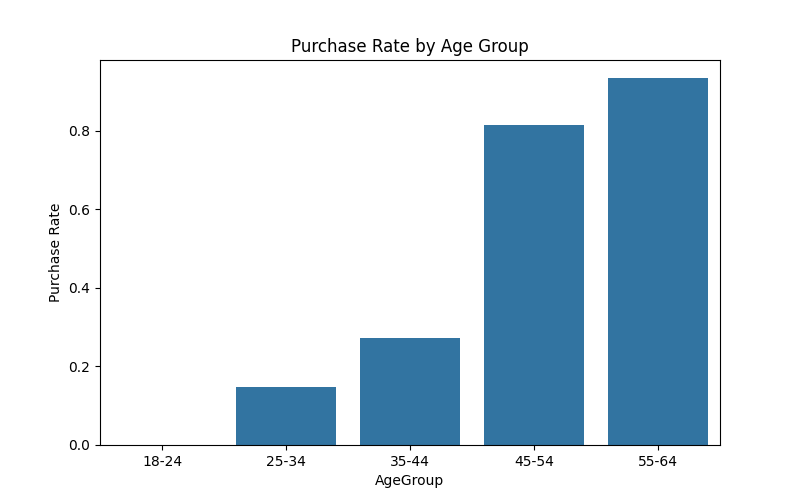
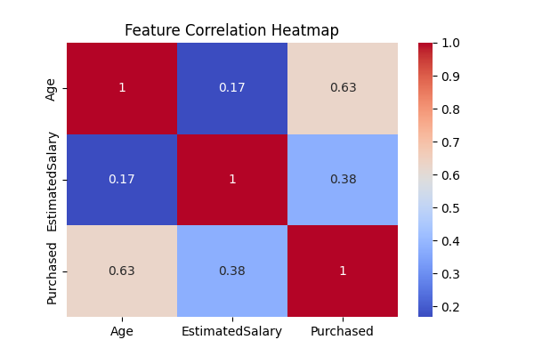

# Social Media Buying Behavior Analysis


## Project Overview
This project analyzes social media advertisement data to understand consumer buying behavior. It implements a complete ETL (Extract, Transform, Load) pipeline using Python to process the data, clean it, and generate meaningful insights through visualizations.
The goal is to explore how factors like age and estimated salary influence purchase decisions after viewing advertisements.


## ETL Pipeline

-  **Extract** : Loads the dataset (`social_ads.csv`) from the `data/` folder.
-  **Transform** : Cleans the data by removing duplicates and missing values, and categorizes age into groups.
-  **Load** : Saves the cleaned dataset into the `insights/` folder for further analysis.
-  **Insights Generation** : Creates visualizations (purchase distributions by age and salary) and calculates purchase rates, saving charts in the `insights/` folder.


## How to Run the Project

1. **Clone the repository**

```bash
git clone https://github.com/rashmi-ekanayake/Social-Advertisement-ETL-insights.git
cd Social-Advertisement-ETL-insights

```

  
2. **Install dependencies**

   It is recommended to use a virtual environment:

```bash
python -m venv venv
source venv/bin/activate           # On Windows use `venv\Scripts\activate`
pip install -r requirements.txt
```


3. **Download the dataset**

   Download the dataset from Kaggle and place the file `social_ads.csv` into the `data/` folder:

👉 [Social Advertisement Dataset on Kaggle](https://www.kaggle.com/datasets/sakshisatre/social-advertisement-dataset/data)


4. **Run the pipeline**

```bash
python main.py
```
  This will execute the ETL process and generate insights saved in the insights/ folder.


## Features
✅ Full ETL Pipeline using modular Python code (Extract, Transform, Load)

📊 Visual Analysis of user purchasing behavior by age and salary

🧱 Clean and Modular Codebase using function-based and class-based design

🧪 Unit Tests Added to ensure data extraction works correctly and reliably

📁 Insight Charts auto-generated and saved in the insights/ folder

📦 Easy to run and extend for additional datasets or business use cases


## Project Structure

```bash
Social-Advertisement-ETL-insights/
├── data/
│   └── social_ads.csv
├── insights/
│   ├── purchase_by_age.png
│   ├── purchase_by_salary.png
│   ├── purchase_rate_by_agegroup.png
│   ├── correlation_heatmap.png
│   └── cleaned_data.csv
├── src/
│   ├── extract.py
│   ├── transform.py
│   ├── load.py
│   └── insights.py
├── test_pipeline.py
├── main.py
├── requirements.txt
└── README.md
```

## Sample Outputs


### **Overall Purchase Rate**
``` bash
Overall Purchase Rate: 37.60%
```


### Purchase Distribution by Age


### Purchase Distribution by Estimated Salary


### Purchase Rate by Age Group



### Feature Correlation Heatmap



### Purchase Rate by Age Group
``` bash
AgeGroup
18-24    0.000000
25-34    0.147368
35-44    0.272000
45-54    0.815789
55-64    0.933333
Name: Purchased, dtype: float64
```


## Dataset Source and License

The dataset used in this project is sourced from Kaggle:
[Social Advertisement Dataset on Kaggle](https://www.kaggle.com/datasets/sakshisatre/social-advertisement-dataset/data)

Please refer to Kaggle for license details.

